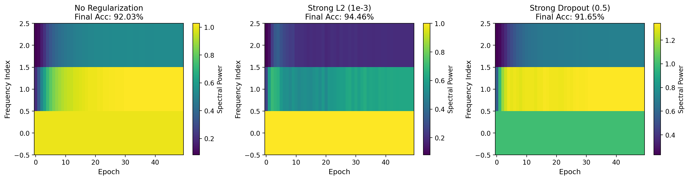
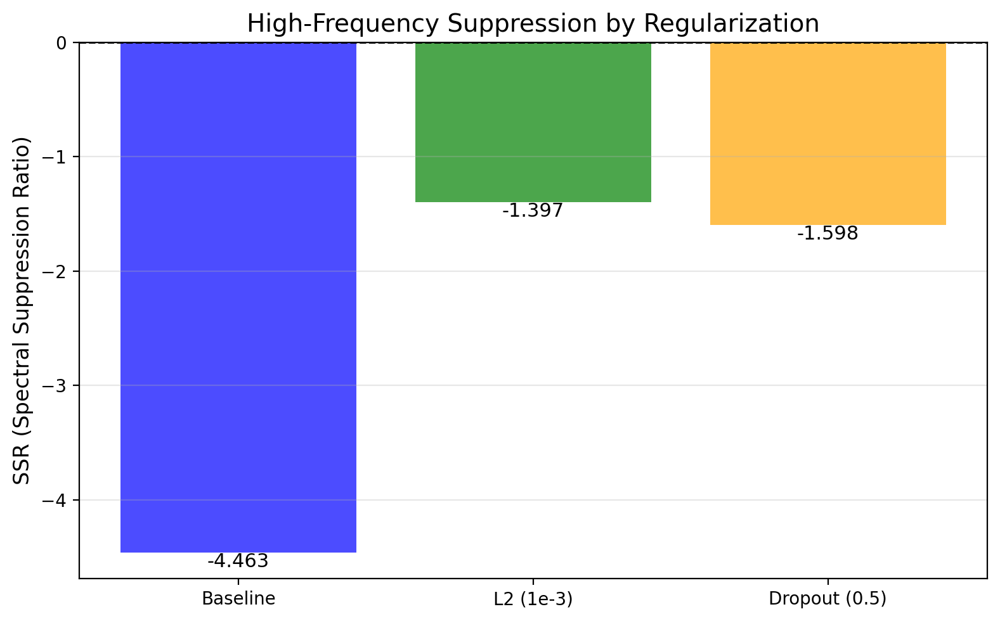
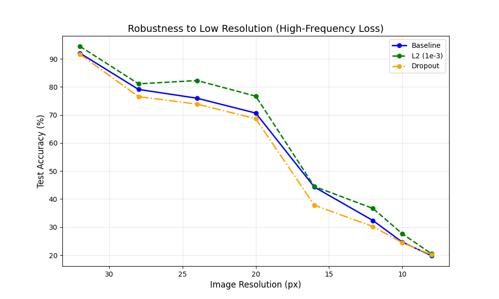

# 🔍 Frequency Regularization: A Spectral Analysis of Deep Neural Networks
# 🔍 频率正则化：深度神经网络的光谱分析

> **Unveiling the "Invisible" Low-Pass Filtering Effect of Regularization in Modern CNNs.**  
> **揭示正则化在现代 CNN 中的"隐形"低通滤波效应。**

[](https://pytorch.org/)
[](LICENSE)

## 📖 Introduction | 简介

Why does L2 Regularization (Weight Decay) improve generalization? The common answer is "it keeps weights small." But **what does that mean physically?**

This project investigates the **Spectral Bias** of Neural Networks. By analyzing ResNet-18 on CIFAR-10 in the frequency domain, we provide visual and quantitative evidence that **Regularization acts as a Low-Pass Filter**, forcing the model to learn robust low-frequency shapes while ignoring high-frequency noise.

**：**  
为什么 L2 正则化（权重衰减）能提升泛化能力？常见的答案是"它让权重变小"。但**这在物理上意味着什么？**

本项目研究神经网络的**频谱偏差（Spectral Bias）**。通过在频域分析 ResNet-18 在 CIFAR-10 上的表现，我们提供了视觉和定量证据，证明**正则化起到了低通滤波器的作用**，迫使模型学习鲁棒的低频形状，同时忽略高频噪声。

## 🚀 Key Contributions | 核心贡献


1.  **Visual Diagnostic Framework:** A dynamic heatmap system that tracks how weight frequencies evolve during training.
2.  **SSR Metric (Spectral Suppression Ratio):** A novel metric proposed to quantify the intensity of high-frequency suppression.
3.  **Engineering Optimization:** Implemented a **Discrete Radial Profiling** algorithm to enable accurate FFT analysis on small ($3\times3$) convolutional kernels.
4.  **Robustness Discovery:** Revealed that L2 models are highly robust to **Low Resolution** (High-Freq Loss) but sensitive to **Gaussian Noise**, proving their reliance on low-frequency structures.


1.  **可视化诊断框架：** 动态热图系统，追踪权重频率在训练过程中的演变。
2.  **SSR 指标（频谱抑制比）：** 提出的新指标，用于量化高频抑制的强度。
3.  **工程优化：** 实现了**离散径向轮廓分析**算法，使小尺寸（$3\times3$）卷积核的 FFT 分析成为可能。
4.  **鲁棒性发现：** 揭示了 L2 模型对**低分辨率**（高频损失）高度鲁棒，但对**高斯噪声**敏感，证明了其对低频结构的依赖。

---

## 📊 Main Results | 主要结果

### 1. The "Invisible" Filter (Spectral Evolution) | "隐形"滤波器（频谱演变）

**:**  
*Left: No Regularization (High-freq noise accumulates). Right: L2 Regularization (High-freq stays dark/suppressed).*

**：**  
*左图：无正则化（高频噪声累积）。右图：L2 正则化（高频保持暗色/被抑制）。*



**:** *(Note: The top rows represent high frequencies. L2 keeps them "clean".)*  
**：** *（注：顶部行代表高频。L2 保持它们"干净"。）*

### 2. Quantifying the Suppression (SSR) | 量化抑制（SSR）

**:**  
Using our **SSR Metric**, we found that L2 regularization suppresses the growth of high-frequency energy by **~3x** compared to the baseline.

**：**  
使用我们的**SSR 指标**，我们发现 L2 正则化将高频能量的增长抑制了**约 3 倍**，相比基线模型。



### 3. The Robustness Proof (Low Resolution) | 鲁棒性证明（低分辨率）

**:**  
When image resolution drops (simulating high-frequency loss), the L2 model (Green) significantly outperforms the Baseline (Blue). **At 24x24 px, L2 leads by >6%.**

**：**  
当图像分辨率降低（模拟高频损失）时，L2 模型（绿色）显著优于基线模型（蓝色）。**在 24x24 像素下，L2 领先 >6%。**



---

## 🛠️ Installation & Usage | 安装与使用

### 1. Clone the repository | 克隆仓库
```bash
git clone https://github.com/yourusername/FrequencyRegularization.git
cd FrequencyRegularization
```

### 2. Install dependencies | 安装依赖
```bash
pip install torch torchvision numpy matplotlib pandas tqdm scipy
```

### 3. Run Experiments | 运行实验

**Experiment A: Synthetic Demo (Proof of Concept) | 实验 A：合成数据演示（概念验证）**
```bash
python experiments/exp_a_synthetic.py
```

**Experiment B: Spectral Evolution & SSR (Core Analysis) | 实验 B：频谱演变与 SSR（核心分析）**  
**:** Trains ResNet-18 models and generates spectral heatmaps.  
**：** 训练 ResNet-18 模型并生成频谱热图。
```bash
python experiments/exp_b_spectrum_evolution.py
```

**Experiment C: Noise Robustness (The Trade-off) | 实验 C：噪声鲁棒性（权衡）**  
**:** Tests models against Gaussian Noise.  
**：** 测试模型对高斯噪声的鲁棒性。
```bash
python experiments/exp_c_robustness.py
```

**Experiment D: Resolution Robustness (The Advantage) | 实验 D：分辨率鲁棒性（优势）**  
**:** Tests models against Low Resolution / Blur.  
**：** 测试模型对低分辨率/模糊的鲁棒性。
```bash
python experiments/exp_d_resolution_robustness.py
```

## 📂 Project Structure | 项目结构

```
FrequencyRegularization/
├── data/               # Data loaders and preprocessing | 数据加载与预处理
├── models/             # ResNet implementation | ResNet 实现
├── utils/
│   ├── frequency.py    # [CORE] FFT & Radial Profile algorithms (Optimized for 3x3 kernels) | [核心] FFT 与径向轮廓算法（针对 3x3 核优化）
│   └── visualizer.py   # Plotting tools | 绘图工具
├── experiments/
│   ├── exp_b_spectrum_evolution.py  # Training & Frequency Analysis | 训练与频率分析
│   └── exp_d_resolution_robustness.py # Robustness Testing | 鲁棒性测试
├── results/            # Output figures and checkpoints | 输出图表与检查点
└── README.md
```

## 🧠 Theory Reference | 理论参考

**:**  
This project builds upon the theory of Spectral Bias:
- Rahaman et al., "On the Spectral Bias of Neural Networks", ICML 2019.
- Xu et al., "Frequency Principle: Fourier Analysis Sheds Light on Deep Neural Networks", 2019.

**：**  
本项目基于频谱偏差理论：
- Rahaman 等人，"On the Spectral Bias of Neural Networks", ICML 2019.
- Xu 等人，"Frequency Principle: Fourier Analysis Sheds Light on Deep Neural Networks", 2019.
