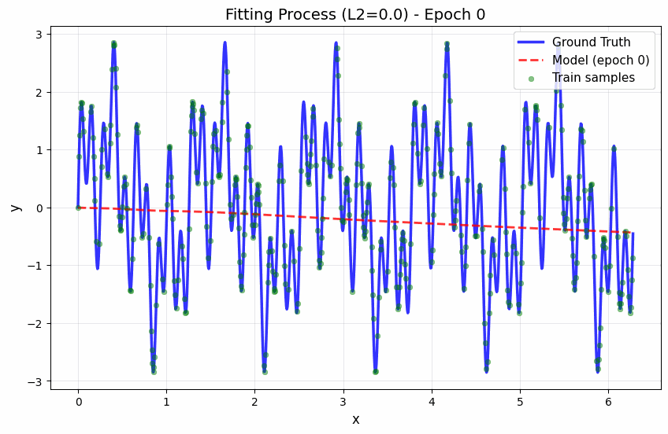
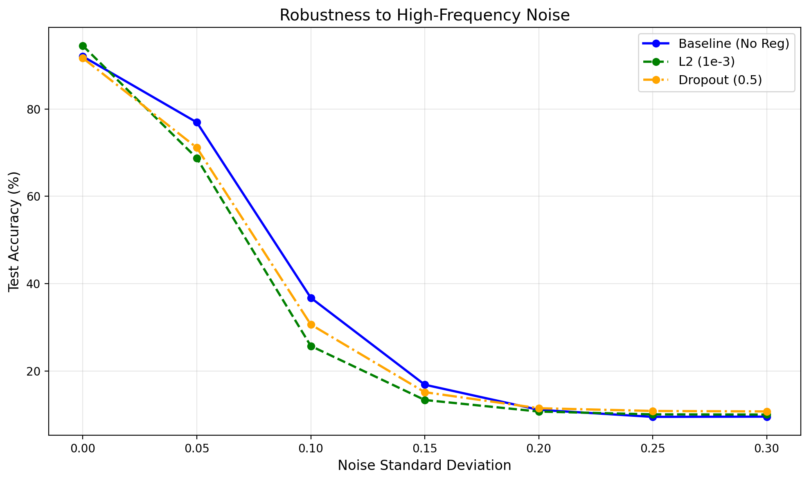

# Frequency-Perspective-Regularization

**A visual analysis framework to understand how Regularization (L2, Dropout) affects the learning order of high/low frequencies in DNNs.**

[](https://www.python.org/downloads/)
[](https://pytorch.org/)

## 📖 项目概述

本项目从**频率视角**研究正则化机制，通过可视化和量化分析揭示：
- **L2 正则化**如何通过抑制高频学习来改善泛化
- **Dropout**对频率学习顺序的影响
- 正则化在不同任务（干净数据 vs 噪声数据）上的权衡

**核心创新点：**
- ⭐ **径向频谱分析工具**：可视化权重和特征图的频率分布
- ⭐ **SSR 指标**：Spectral Suppression Ratio，量化高频抑制程度
- ⭐ **三个关键实验**：从合成数据到真实数据，系统验证频率视角

## 🎯 核心发现

### Finding 1: L2 Regularization acts as a Low-Pass Filter
L2 正则化通过抑制高频成分的学习，使模型优先学习低频信号。这在合成数据实验中清晰可见：模型先学会 `sin(5x)`，再学会 `sin(20x)`，而 `sin(50x)` 可能永远学不会。

### Finding 2: Dropout introduces high-frequency noise
Dropout 在训练时引入随机噪声，这可能导致模型学习到更多高频细节，但在测试时这些细节可能不存在，从而防止过拟合。

### Finding 3: Regularization improves robustness to high-frequency noise
虽然强正则化可能在干净数据上准确率略低，但在高频噪声数据上表现更稳定，证明了正则化通过抑制高频学习间接实现了抗噪。

## 🚀 快速开始

### 1. 环境设置

```bash
cd FrequencyRegularization

# 方法1：安装所有依赖（推荐）
pip install -r requirements.txt

# 方法2：如果遇到问题，可以单独安装
pip install torch torchvision numpy matplotlib pandas tqdm scipy imageio
```

**注意**：如果使用 conda 虚拟环境，请确保已激活环境后再安装依赖。

### 2. 运行实验

#### 实验A：合成数据拟合（最直观的原理展示）

```bash
python main.py --experiment a --epochs 200 --l2_reg 1e-3
```

**预期输出：**
- `results/figures/exp_a_fitting.gif` - 拟合过程动图（展示模型如何逐步学习不同频率）
- `results/figures/exp_a_frequency_curves.png` - 频率学习曲线对比

**预期现象：**
- Baseline：模型先学会低频 (k=5)，再学会中频 (k=20)，最后才学会高频 (k=50)
- L2 Regularization：可能永远学不会高频 (k=50)

#### 实验B：真实数据的频谱演变（进阶）

```bash
python main.py --experiment b --epochs 50 --l2_reg 1e-3 --dropout 0.5
```

**预期输出：**
- `results/figures/exp_b_spectrum_evolution.png` - 权重频谱演变热力图
- `results/figures/exp_b_ssr_comparison.png` - SSR 指标对比

**预期现象：**
- 强 L2 正则化的模型，其卷积核非常"平滑"（高频能量极低）
- SSR > 0 表示正则化抑制了高频

#### 实验C：高频噪声鲁棒性（应用价值）

```bash
python main.py --experiment c
```

**注意：** 需要先运行实验B训练模型。

**预期输出：**
- `results/figures/exp_c_robustness.png` - 鲁棒性曲线（准确率 vs 噪声水平）

**预期现象：**
- 强正则化的模型在噪声数据上准确率下降得更慢

#### 运行所有实验

```bash
python main.py --experiment all --epochs 200
```

## 📁 项目结构

```
FrequencyRegularization/
├── data/                    # 数据加载与预处理
│   ├── toy_data.py         # 1D 合成数据生成
│   └── filtered_data.py    # 低通/高通过滤数据集
├── models/                 # 模型定义
│   ├── mlp.py             # MLP for toy experiments
│   ├── cnn.py             # Simple CNN
│   └── resnet.py          # ResNet-18
├── utils/
│   ├── frequency.py       # [核心] 频率分析工具（径向频谱、SSR等）
│   └── visualization.py   # 画图工具
├── experiments/           # 实验脚本
│   ├── exp_a_synthetic.py      # 实验A：合成数据拟合
│   ├── exp_b_spectrum_evolution.py  # 实验B：频谱演变
│   └── exp_c_robustness.py     # 实验C：噪声鲁棒性
├── main.py                # 统一入口
├── requirements.txt       # 依赖
└── README.md             # 本文档
```

## 🔬 核心工具

### 径向频谱分析

```python
from utils.frequency import get_radial_spectrum

# 分析图像或特征图的径向频谱
spectrum, frequencies = get_radial_spectrum(img_tensor)
# spectrum: 1D 数组，从低频到高频的能量分布
# frequencies: 对应的频率值
```

### SSR 指标

```python
from utils.frequency import compute_ssr

# 计算 Spectral Suppression Ratio
ssr, energy_before, energy_after = compute_ssr(
    spectrum_before,  # 训练前的频谱
    spectrum_after,   # 训练后的频谱
    high_freq_threshold=0.5  # 高频阈值
)
# SSR > 0: 正则化抑制了高频
# SSR < 0: 正则化引入了高频
```

### 过滤数据集

```python
from data.filtered_data import get_cifar10_filtered_datasets

# 获取低通/高通数据集
datasets = get_cifar10_filtered_datasets(sigma=2.0)
train_lowpass = datasets['train_lowpass']  # 高斯模糊（低频）
train_highpass = datasets['train_highpass']  # 边缘（高频）
```

## 📊 实验结果示例

### 实验A：合成数据拟合



**观察：** 模型先学会大波浪（低频），再学会小抖动（高频）

### 实验B：频谱演变


**观察：** L2 正则化的模型，权重频谱中高频能量明显更低

### 实验C：噪声鲁棒性



**观察：** 正则化模型在噪声数据上表现更稳定

## 🎓 理论背景

### Spectral Bias
神经网络在训练时存在**频率偏置（Spectral Bias）**：模型倾向于先学习低频成分，后学习高频成分。这是因为：
- 低频函数在参数空间中更"平滑"
- 梯度下降更容易优化低频目标

### Regularization as Frequency Filter
正则化可以理解为**频率滤波器**：
- **L2 正则化**：低通滤波器，抑制高频学习
- **Dropout**：引入高频噪声，防止过拟合到高频细节

### SSR 指标
**Spectral Suppression Ratio (SSR)** 量化了正则化对高频的抑制程度：

$$SSR = \frac{E_{high}^{before} - E_{high}^{after}}{E_{high}^{before}}$$

- SSR > 0：正则化抑制了高频
- SSR < 0：正则化引入了高频
- SSR ≈ 0：无明显影响

## 📝 论文贡献点（Contribution）

1. **Systematic Spectral Analysis**: 系统性量化分析不同正则化方法对频率学习顺序的影响
2. **Visualization Framework**: 提出可视化框架，追踪训练过程中权重频谱的演变
3. **SSR Metric**: 提出 Spectral Suppression Ratio 指标，量化正则化的"低通滤波"能力
4. **Frequency-based Interpretability**: 从频率视角解释正则化如何通过抑制高频改善泛化
5. **Robustness Analysis**: 揭示正则化在干净数据与噪声数据上的权衡机制

## 🔧 高级用法

### 自定义实验

```python
from utils.frequency import get_radial_spectrum, compute_ssr
from models.resnet import ResNet18

# 训练模型
model = ResNet18(num_classes=10, dropout=0.5)
# ... 训练代码 ...

# 分析第一层卷积核的频谱
first_conv_weight = model.conv1.weight.data
spectrum, _ = get_radial_spectrum(first_conv_weight)

# 计算 SSR（需要训练前后的频谱）
ssr, _, _ = compute_ssr(spectrum_before, spectrum_after)
```

### 分析特征图

```python
# 在训练过程中提取特征图
model.eval()
with torch.no_grad():
    features = model.conv1(images)  # 特征图
    spectrum, _ = get_radial_spectrum(features[0])  # 分析第一个样本
```

## 🐛 常见问题

### Q1: 运行实验A时没有看到明显的频率偏置？
**A**: 
- 确保训练足够 epoch（至少 200）
- 检查模型容量（width=128 应该足够）
- 尝试调整高频幅度

### Q2: 实验B训练时间太长？
**A**: 
- 可以减少 epochs（如 20-30）
- 使用 GPU 加速
- 减小 batch size（但可能影响结果）

### Q3: 实验C提示模型不存在？
**A**: 
- 需要先运行实验B训练模型
- 或者修改代码使用预训练模型

### Q4: 如何扩展到其他数据集？
**A**: 
- 修改 `data/filtered_data.py` 中的数据加载逻辑
- 调整模型输入尺寸（在 `models/` 中）

## 📚 参考文献

- [Frequency Principle: Fourier Analysis Sheds Light on Deep Neural Networks](https://arxiv.org/abs/1901.06523)
- [On the Spectral Bias of Neural Networks](https://arxiv.org/abs/1806.08734)
- [Implicit Regularization in Deep Learning](https://arxiv.org/abs/1811.10181)

## 📄 许可证

MIT License

## 👥 贡献

欢迎提交 Issue 和 Pull Request！

## 📧 联系方式

如有问题或建议，请提交 Issue。

---

**⭐ 如果这个项目对你有帮助，请给个 Star！**
